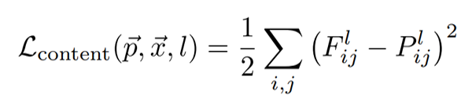
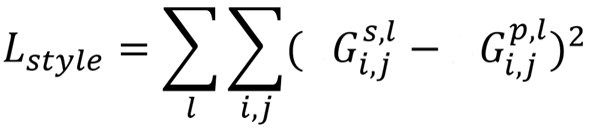

# NST

Neural Style Transfer is the process of blending a *style* from an image you would like to extract the visual properties from, onto a *content* image while keeping spatial information. Its an application of computer vision using Convolutional Neural Networks. The NST employs a pre-trained Convolutional Neural Network to activate the neurons in a particular way so that the content and style match to preserve content image spatial information while imposing style aspects to the output. 

The VGG model, which is pretrained to perform object recognition and localization on natural images, extracting high level semantic information from the content and style images. The content image is processed throughout the VGG model by extracting high level content of the image, while discarding the detailed pixel information in lower levels. The style image is different however, where the goal is to capture texture and colour information while discarding information regarding the global arrangement of the scene. 

## Content Loss 

Content loss is calculated by Euclidean distance between the feature respresntation (F) of the content image (x) and the feature representation (P) of the target image (p). See the code [here](https://github.com/prayge/NST/blob/ee724dce022250ff32c9ba0acf348374bc44afb0/main.py#L75).




## Style Loss

Style loss uses a *Gram Matrix* to interpret style information. A Gram matrix is computed by taking an initial matrix of data and mutliplying it by the a transposed version of the matrix. The Style loss is calculated by the distance between the gram matrices and the style image. See the code [here]()


## Installation and Usage

The program uses a set of *Config* options from `init.py` which have a set of defualt parameters, so simply run the program after installing all prerequisite libraries. 
```
git clone --recursive https://github.com/prayge/NST.git
pip install -r requirements.txt
python main.py --content='png/content.png' --style='png/style.png'
python main.py --contentimage='test/piccy.jpg' --styleimage='test/style.jpg'
```

## Results

The following results are a combination of `./test/content.jpg` as the content image and `./style.jpg` as the style with 2000 steps. 


